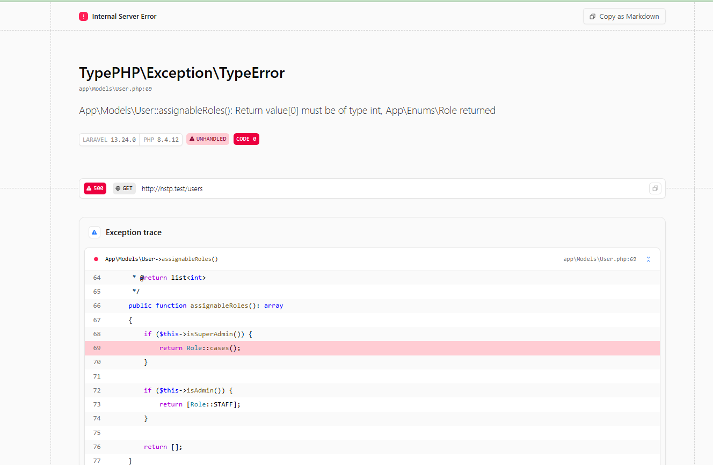
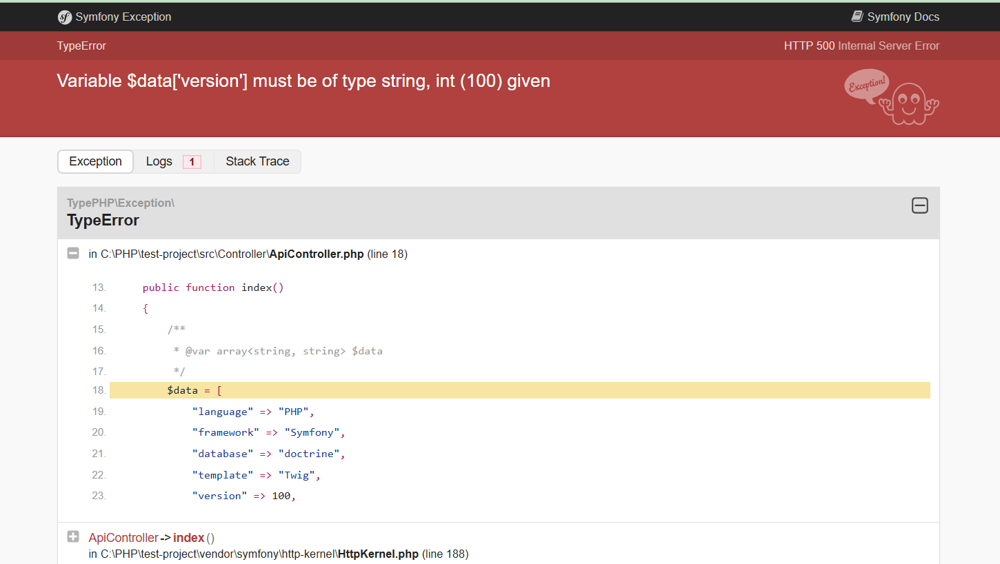
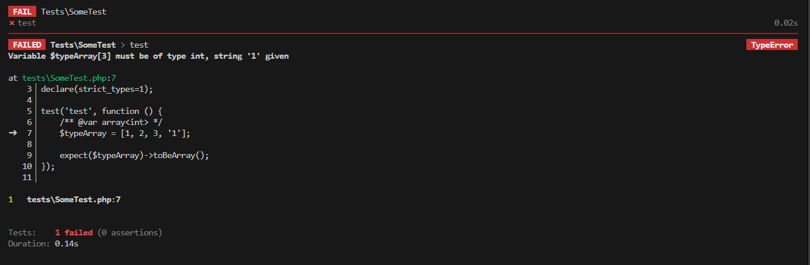

<h1 align="center">TypePHP</h1>

<p align="center">
  <b>No transpilation. No build steps. No C-extensions.<br>
  Drop TypePHP into your existing codebase and let your DocBlocks scream when types fail.</b>
</p>

<p align="center">
	<a href="https://github.com/typephp-php/typephp/actions"></a>
	<a href="https://packagist.org/packages/typephp/typephp"></a>
	<a href="https://packagist.org/packages/typephp/typephp"></a>
	<a href="https://choosealicense.com/licenses/mit/"></a>
	<a href="https://packagist.org/packages/typephp/typephp"></a>
	<a href="https://phpstan.org/"></a>
</p>

---

TypePHP is a transparent, pure-PHP runtime type checker. You don't have to refactor a single line of your codebase, set up complex build toolchains, or compile C-extensions. Simply run your existing code, and TypePHP will enforce your extended PHPDoc contracts (generics, array shapes, `key-of`/`value-of` extractions, and scalar refinements) dynamically at runtime.

**[Read the full TypePHP documentation »](https://typephp-php.github.io/docs/)**

**[Quick Start Guide »](https://typephp-php.github.io/docs/getting-started/quick-start)**

---

## Live Diagnostics (Zero Line-Drift)

When a type contract fails, web exception handlers (**Laravel Ignition, Symfony ErrorHandler, Whoops**) and CLI test runners (**Pest, PHPUnit**) highlight **the exact line of code** in your application where the invalid data was passed, with **zero line-drift**:

### Web Framework Trace (Laravel Ignition)
<p align="center">
  
</p>

### Web Framework Trace (Symfony ErrorHandler)
<p align="center">
  
</p>

### CLI Test Runner Trace (Pest PHP)
<p align="center">
  
</p>

---

## See It In Action

### 1. Framework Boundary Protection (Laravel / Symfony)
Prevent dynamic data bugs from leaking into database queries or API responses:

```php
namespace App\Models;

use App\Enums\Role;
use Illuminate\Database\Eloquent\Model;

class User extends Model
{
    /**
     * @return list<int>
     */
    public function assignableRoles(): array
    {
        if ($this->isSuperAdmin()) {
            // Bug! Returns an array of Role Enum instances instead of integers:
            return Role::cases(); 
        }

        return [Role::STAFF->value];
    }
}

// Executing $user->assignableRoles() throws:
// TypePHP\Exception\TypeError: User::assignableRoles(): Return value[0] must be of type int, App\Enums\Role returned
```

### 2. True Runtime Generics with Memory State
Define generic templates and TypePHP tracks their state per object instance in memory using native `\WeakMap`:

```php
/**
 * @template T
 */
class Collection 
{
    /** @param T $item */
    public function add(mixed $item): void { /* ... */ }
}

// Prebind T = User to this specific instance in WeakMap memory
/** @var Collection<User> $users */
$users = new Collection();

$users->add(new User('Alice')); // Valid

$users->add(new Product('SKU-100')); 
// Throws TypeError: Argument $item (template T = User) must be of type User, Product given
```

### 3. Array Shapes & Constant Extractions
Enforce strict associative array structures and constant key/value extractions:

```php
namespace App\Services;

use App\Database\DriverManager;

/**
 * @phpstan-type ConnectionParams array{
 *     driver: key-of<DriverManager::DRIVER_MAP>,
 *     driverClass?: value-of<DriverManager::DRIVER_MAP>
 * }
 */
class DatabaseService
{
    /**
     * @param ConnectionParams $params
     */
    public function connect(array $params): void
    {
        // ...
    }
}

$service = new DatabaseService();

$service->connect(['driver' => 'pdo_mysql']); // Valid

$service->connect(['driver' => 'pdo_invalid']);
// Throws TypeError: Argument $params['driver'] must be a key of DriverManager::DRIVER_MAP
```

---

## Documentation

All the documentation lives on the **[typephp-php.github.io/docs website](https://typephp-php.github.io/docs/)**:

* [Getting Started & Installation Guide](https://typephp-php.github.io/docs/getting-started/installation)
* [Quick Start Guide](https://typephp-php.github.io/docs/getting-started/quick-start)
* [Configuration Guide](https://typephp-php.github.io/docs/getting-started/configuration)
* [CLI Commands Reference](https://typephp-php.github.io/docs/getting-started/cli-commands)
* [Runtime Generics (Flagship)](https://typephp-php.github.io/docs/generics/basics-and-bounds)
* [Enforcement Boundaries: Function Contracts](https://typephp-php.github.io/docs/core-concepts/function-contracts)
* [Supported Types: Arrays & Shapes](https://typephp-php.github.io/docs/supported-types/arrays-and-shapes)
* [Architecture: How It Works](https://typephp-php.github.io/docs/advanced/how-it-works)
* [Official Blog & Announcements](https://typephp-php.github.io/docs/blog/)
* [Troubleshooting & FAQ](https://typephp-php.github.io/docs/troubleshooting)

## Inspiration

TypePHP is conceptually inspired by Python's [Beartype](https://github.com/beartype/beartype), bringing transparent runtime type enforcement for type annotations to the PHP ecosystem without any decorators or attributes.

## Sponsors

Want to support the open-source development and maintenance of TypePHP? [Sponsor me on GitHub »](https://github.com/sponsors/rcalicdan)

## Contributing

Any contributions are welcome. Feel free to open issues or submit pull requests on GitHub.

## License

TypePHP is open-source software licensed under the [MIT License](https://choosealicense.com/licenses/mit/).
